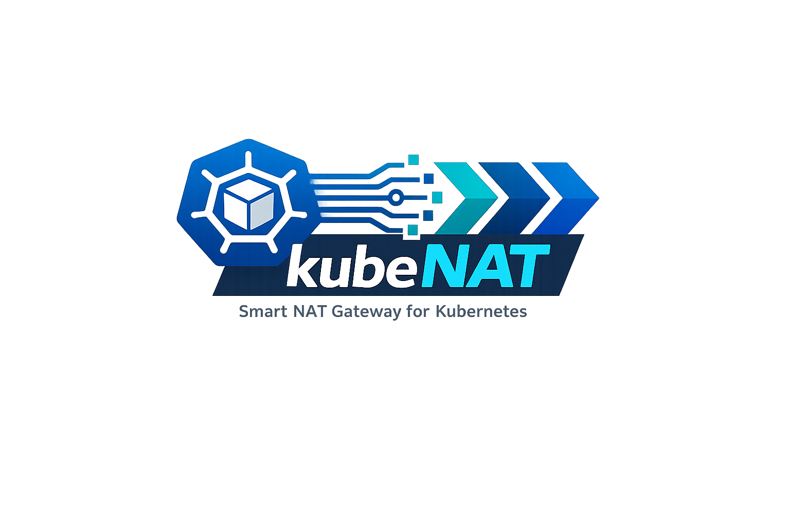

<p align="center">
  
</p>

# kube-nat

> **For agentic readers:** This document is structured for both human and automated consumption. Each section is self-contained. Key facts are front-loaded. Configuration reference is machine-parseable. Jump to any section directly.

kube-nat replaces AWS NAT Gateways with a self-managed iptables MASQUERADE DaemonSet running on Kubernetes spot instances. Pods on private subnets reach the internet through the kube-nat agent on their node's availability zone, which performs SNAT via the instance's existing Elastic IP — no NAT Gateway required.

---

## Why replace NAT Gateway?

### The cost problem

AWS NAT Gateway charges on two axes that compound quickly:

| Charge | Rate |
|---|---|
| Per NAT Gateway per hour | $0.045 |
| Per GB of data processed | $0.045 |

A standard highly-available setup runs one NAT Gateway per AZ. On a three-AZ cluster:

| Scenario | NAT Gateway/month | kube-nat/month | Monthly saving |
|---|---|---|---|
| 3 AZs, 500 GB outbound | $97.20 fixed + $22.50 data = **$119.70** | ~$15 (3× spot t3.small) | **$104** |
| 3 AZs, 2 TB outbound | $97.20 + $90 = **$187.20** | ~$15 | **$172** |
| 3 AZs, 10 TB outbound | $97.20 + $450 = **$547.20** | ~$15 | **$532** |
| 3 AZs, 50 TB outbound | $97.20 + $2,250 = **$2,347.20** | ~$15 | **$2,332** |

_kube-nat nodes are spot instances managed by Karpenter. Data processing through an EC2 instance is free — you only pay for the instance-hours. Prices as of 2025, us-east-1._

### Other advantages over NAT Gateway

- **No cross-AZ data transfer charges.** Traffic stays within the AZ — the kube-nat agent is always co-located with the pods it serves.
- **Observability.** NAT Gateway gives you CloudWatch metrics with 1-minute granularity. kube-nat exposes per-agent Prometheus metrics and a real-time dashboard with 5-second resolution.
- **No AWS service limits.** NAT Gateway has a fixed 100 Gbps bandwidth cap per gateway. kube-nat throughput scales with the instance type you choose.
- **Spot-safe.** The three-layer failover mechanism (spot notice → SIGTERM → TCP heartbeat) ensures traffic resumes within 400ms of a spot interruption.

---

## How it works

```
┌─────────────────────── AZ eu-west-1a ──────────────────────────┐
│                                                                  │
│  ┌──────────┐    iptables MASQUERADE    ┌────────────────────┐  │
│  │  pod     │ ─────────────────────────▶│  kube-nat agent    │─▶ internet
│  │ 10.0.1.5 │                           │  (spot instance)   │  │
│  └──────────┘                           │  EIP: 1.2.3.4      │  │
│                                         └────────────────────┘  │
└──────────────────────────────────────────────────────────────────┘
```

Each kube-nat agent:

1. **Owns its AZ** by holding a Kubernetes Lease (`coordination.k8s.io/v1`). One agent per AZ is active at any time.
2. **Programs iptables** with a `MASQUERADE` rule on the host network interface so pod traffic SNATs to the instance's EIP.
3. **Manages EC2 route tables** (in `auto` mode) to insert a `0.0.0.0/0` route via the instance ENI into all subnets in its AZ.
4. **Broadcasts TCP heartbeats** every 200ms to peer agents. If a peer misses 2 consecutive beats (~400ms), the surviving agent initiates takeover.
5. **Watches for spot interruption notices** via the EC2 instance metadata service. On a two-minute notice, the agent gracefully steps down — releases the lease, removes iptables rules, withdraws the route — so the next agent can take over cleanly.

### Failover layers

| Layer | Trigger | Latency |
|---|---|---|
| Spot notice watcher | EC2 metadata `/spot/termination-time` polled every 5s | ~100ms after notice |
| SIGTERM handler | Karpenter drain / pod eviction | ~100ms |
| TCP peer heartbeat | 2 missed beats × 200ms interval | ~400ms |

### Components

| Component | Kind | Purpose |
|---|---|---|
| `kube-nat agent` | DaemonSet | iptables, EC2 routes, lease, peer heartbeats, spot watcher |
| `kube-nat dashboard` | Deployment | Prometheus scraper + WebSocket server + React SPA |

---

## Prerequisites

- Kubernetes 1.25+ on AWS EKS
- Karpenter managing the NAT nodes (recommended) or any node provisioner
- Each NAT node must have:
  - An Elastic IP associated with its primary network interface
  - `src/dst check` disabled on the ENI (required for MASQUERADE to work)
  - Outbound route to the internet on its subnet
- An IAM role with permissions to modify route tables, reachable via IRSA:

```json
{
  "Version": "2012-10-17",
  "Statement": [
    {
      "Effect": "Allow",
      "Action": [
        "ec2:DescribeRouteTables",
        "ec2:CreateRoute",
        "ec2:ReplaceRoute",
        "ec2:DeleteRoute"
      ],
      "Resource": "*"
    }
  ]
}
```

---

## Quick start

### 1. Label the NAT nodes

kube-nat agents only run on nodes labelled `node-role.kubernetes.io/nat=true`. Apply this label in your Karpenter `NodePool` or manually:

```yaml
# karpenter NodePool excerpt
spec:
  template:
    metadata:
      labels:
        node-role.kubernetes.io/nat: "true"
    spec:
      requirements:
        - key: karpenter.sh/capacity-type
          operator: In
          values: ["spot"]
        - key: topology.kubernetes.io/zone
          operator: In
          values: ["eu-west-1a", "eu-west-1b", "eu-west-1c"]
```

### 2. Install with Helm

```bash
helm upgrade --install kube-nat \
  oci://ghcr.io/mfeldheim/kube-nat/helm/kube-nat \
  --namespace kube-nat \
  --create-namespace \
  --set agent.irsaRoleArn=arn:aws:iam::123456789012:role/kube-nat \
  --set image.tag=v0.1.0
```

Or with a values file:

```bash
helm upgrade --install kube-nat oci://ghcr.io/mfeldheim/kube-nat/helm/kube-nat \
  --namespace kube-nat \
  --create-namespace \
  -f my-values.yaml
```

### 3. Verify

```bash
# Agents should be Running on every NAT node
kubectl get pods -n kube-nat -o wide

# Check which agent owns each AZ
kubectl get leases -n kube-nat

# Open the dashboard
kubectl port-forward -n kube-nat svc/kube-nat-dashboard 8080:8080
# then visit http://localhost:8080
```

---

## Configuration reference

### Helm values

```yaml
image:
  repository: ghcr.io/mfeldheim/kube-nat  # container image
  tag: latest                              # image tag (pin to a version in production)
  pullPolicy: IfNotPresent

namespace: kube-nat                        # namespace for all resources

agent:
  irsaRoleArn: ""                          # REQUIRED: IAM role ARN for EC2 route table access
  mode: auto                               # "auto" = manage EC2 routes; "manual" = iptables only
  conntrackMax: ""                         # override nf_conntrack_max (empty = kernel default)
  tagPrefix: kube-nat                      # prefix for EC2 resource tags
  nodeSelector:
    node-role.kubernetes.io/nat: "true"    # nodes where agents are scheduled
  resources:
    requests: {cpu: 50m, memory: 64Mi}
    limits:   {cpu: 200m, memory: 128Mi}

dashboard:
  replicas: 1
  scrapeInterval: 5s                       # how often to scrape agent /metrics
  port: 8080
  resources:
    requests: {cpu: 20m, memory: 32Mi}
    limits:   {cpu: 100m, memory: 128Mi}

serviceMonitor:
  enabled: false                           # enable if Prometheus Operator is installed
  interval: 30s
```

### Agent environment variables

All agent configuration is also available as environment variables (Helm injects them automatically):

| Variable | Default | Description |
|---|---|---|
| `KUBE_NAT_MODE` | `auto` | `auto` manages EC2 routes; `manual` iptables only |
| `KUBE_NAT_TAG_PREFIX` | `kube-nat` | Prefix for EC2 resource tags |
| `KUBE_NAT_CONNTRACK_MAX` | _(kernel default)_ | Override `nf_conntrack_max` sysctl |
| `KUBE_NAT_LEASE_DURATION` | `15s` | How long a lease is valid without renewal |
| `KUBE_NAT_PROBE_INTERVAL` | `200ms` | TCP heartbeat interval between peer agents |
| `KUBE_NAT_PROBE_FAILURES` | `2` | Missed heartbeats before triggering takeover |
| `KUBE_NAT_RECONCILE_INTERVAL` | `30s` | How often to reconcile iptables and routes |
| `KUBE_NAT_METRICS_PORT` | `9100` | Port for Prometheus metrics and health endpoints |
| `KUBE_NAT_PEER_PORT` | `9101` | Port for inter-agent TCP heartbeats |
| `KUBE_NAT_AZ_LABEL` | `topology.kubernetes.io/zone` | Node label used to determine the agent's AZ |
| `POD_NAMESPACE` | `kube-system` | Kubernetes namespace (injected by Helm) |

### Dashboard environment variables

| Variable | Default | Description |
|---|---|---|
| `KUBE_NAT_SCRAPE_INTERVAL` | `5s` | How often the dashboard scrapes agent pods |
| `KUBE_NAT_DASHBOARD_PORT` | `8080` | HTTP port for the dashboard server |
| `POD_NAMESPACE` | `kube-nat` | Namespace to discover agent pods in |

---

## Prometheus metrics

All metrics are exposed on `:9100/metrics` by each agent pod.

| Metric | Type | Description |
|---|---|---|
| `kube_nat_bytes_tx_total` | Counter | Total bytes transmitted (SNAT'd outbound) |
| `kube_nat_bytes_rx_total` | Counter | Total bytes received (DNAT'd inbound) |
| `kube_nat_conntrack_entries` | Gauge | Current conntrack table entries |
| `kube_nat_conntrack_max` | Gauge | Maximum conntrack table capacity |
| `kube_nat_route_tables_owned` | Gauge | Number of EC2 route tables currently managed |
| `kube_nat_peer_up` | Gauge | 1 if TCP peer heartbeat is healthy, 0 otherwise |
| `kube_nat_spot_pending` | Gauge | 1 if a spot termination notice has been received |
| `kube_nat_rule_present` | Gauge | 1 if the iptables MASQUERADE rule is in place |
| `kube_nat_src_dst_disabled` | Gauge | 1 if src/dst check is confirmed disabled on the ENI |
| `kube_nat_last_failover_seconds` | Gauge | Unix timestamp of the last failover this agent performed |
| `kube_nat_failover_total` | Counter | Total number of failovers performed by this agent |

### Health endpoints

Each agent exposes two HTTP endpoints on `KUBE_NAT_METRICS_PORT`:

| Path | Ready when |
|---|---|
| `/healthz` | Process is alive |
| `/readyz` | iptables rule is present AND lease is held |

---

## Working examples

### Example: single-AZ cluster (dev/test)

For a simple single-AZ dev cluster, disable HA and use one agent:

```yaml
# values-dev.yaml
agent:
  irsaRoleArn: arn:aws:iam::123456789012:role/kube-nat-dev
  mode: auto
  nodeSelector:
    node-role.kubernetes.io/nat: "true"
  resources:
    requests: {cpu: 10m, memory: 32Mi}
    limits:   {cpu: 100m, memory: 64Mi}

dashboard:
  replicas: 0   # disable dashboard in dev
```

```bash
helm upgrade --install kube-nat oci://ghcr.io/mfeldheim/kube-nat/helm/kube-nat \
  --namespace kube-nat --create-namespace \
  -f values-dev.yaml
```

### Example: three-AZ production cluster

```yaml
# values-prod.yaml
image:
  tag: v0.1.0     # always pin to a specific version in production

agent:
  irsaRoleArn: arn:aws:iam::123456789012:role/kube-nat-prod
  mode: auto
  conntrackMax: "524288"    # tune for high-connection workloads
  nodeSelector:
    node-role.kubernetes.io/nat: "true"
  resources:
    requests: {cpu: 100m, memory: 64Mi}
    limits:   {cpu: 500m, memory: 256Mi}

dashboard:
  replicas: 1
  scrapeInterval: 5s

serviceMonitor:
  enabled: true   # scrape dashboard metrics from Prometheus Operator
```

```bash
helm upgrade --install kube-nat oci://ghcr.io/mfeldheim/kube-nat/helm/kube-nat \
  --namespace kube-nat --create-namespace \
  -f values-prod.yaml
```

### Example: manual mode (no IAM required)

`manual` mode programs iptables only and does not touch EC2 route tables. Use this when you manage routes externally (e.g., Transit Gateway, custom VPC routing).

```yaml
agent:
  mode: manual
  irsaRoleArn: ""   # no IAM role needed
```

You must configure the VPC route table to send `0.0.0.0/0` traffic to the NAT instance ENI yourself.

### Example: Prometheus scrape config (without Operator)

```yaml
# prometheus.yml
scrape_configs:
  - job_name: kube-nat
    kubernetes_sd_configs:
      - role: pod
        namespaces:
          names: [kube-nat]
    relabel_configs:
      - source_labels: [__meta_kubernetes_pod_label_app]
        regex: kube-nat
        action: keep
      - source_labels: [__meta_kubernetes_pod_label_component]
        regex: agent
        action: keep
      - source_labels: [__meta_kubernetes_pod_ip]
        target_label: __address__
        replacement: "$1:9100"
```

### Example: alert rules

```yaml
groups:
  - name: kube-nat
    rules:
      - alert: KubeNatAgentDown
        expr: kube_nat_rule_present == 0
        for: 1m
        labels:
          severity: critical
        annotations:
          summary: "kube-nat agent {{ $labels.pod }} has no iptables rule"

      - alert: KubeNatConntrackHigh
        expr: kube_nat_conntrack_entries / kube_nat_conntrack_max > 0.8
        for: 5m
        labels:
          severity: warning
        annotations:
          summary: "conntrack table >80% full on {{ $labels.pod }}"

      - alert: KubeNatPeerDown
        expr: kube_nat_peer_up == 0
        for: 30s
        labels:
          severity: warning
        annotations:
          summary: "kube-nat peer heartbeat down on {{ $labels.pod }}"
```

---

## FAQ

**Q: Does kube-nat work with Fargate nodes?**  
No. Fargate nodes do not expose the host network or allow iptables manipulation. kube-nat requires EC2 worker nodes.

**Q: Can I run kube-nat agents on on-demand instances?**  
Yes. The spot-interruption watcher is a no-op on on-demand instances. The failover mechanism still works for other failure modes.

**Q: What happens to existing connections during a failover?**  
Established TCP connections that are tracked in conntrack survive if the new agent takes over within the conntrack timeout (default: 432000s for established TCP). In practice, a 400ms failover is transparent to most applications. UDP and short-lived TCP connections may experience brief packet loss.

**Q: Why does the agent need `hostNetwork: true`?**  
iptables rules must be installed in the host network namespace to intercept pod traffic at the node level. Without `hostNetwork`, the agent would only see its own network namespace.

**Q: Why does the agent need `NET_ADMIN` and `NET_RAW` capabilities?**  
`NET_ADMIN` is required to add and remove iptables rules and modify sysctl values (`nf_conntrack_max`). `NET_RAW` is required to send raw TCP packets for the peer heartbeat protocol.

**Q: What is `manual` mode for?**  
When your VPC routing is managed externally (Transit Gateway, Direct Connect, custom routing appliances), set `mode: manual`. kube-nat will still manage the iptables MASQUERADE rule but will not create or modify EC2 route table entries.

**Q: How does kube-nat handle multiple agents in the same AZ?**  
Only one agent per AZ holds the Kubernetes Lease. The inactive agent watches the lease and takes over if the active agent fails to renew it within `KUBE_NAT_LEASE_DURATION` (default: 15s). At most one agent per AZ is active at any time.

**Q: Does kube-nat support IPv6?**  
Not currently. kube-nat manages IPv4 MASQUERADE rules only.

**Q: Can I use a single NAT node for all AZs?**  
Yes, but cross-AZ traffic will incur AWS data transfer charges ($0.01/GB). For cost-optimal deployments, run one agent per AZ.

**Q: How do I migrate from NAT Gateway without downtime?**  
1. Deploy kube-nat in `manual` mode (no route table changes).
2. Verify agents are healthy and iptables rules are in place.
3. For each AZ, update the route table to point `0.0.0.0/0` at the kube-nat ENI instead of the NAT Gateway.
4. Once all AZs are migrated, delete the NAT Gateways.
5. Optionally switch to `mode: auto` to let kube-nat manage route tables going forward.

---

## Troubleshooting

### Pods cannot reach the internet

**Check 1: Is the agent Running and Ready on the node?**

```bash
kubectl get pods -n kube-nat -o wide
# STATUS should be Running, READY should be 1/1
```

**Check 2: Does the agent hold the lease for its AZ?**

```bash
kubectl get leases -n kube-nat
# Each lease should have a holderIdentity matching an agent pod name
```

**Check 3: Is the iptables rule present?**

```bash
# SSH to the NAT node, or use kubectl debug
iptables -t nat -L POSTROUTING -v -n | grep MASQUERADE
# Should show a rule for the pod CIDR
```

**Check 4: Is src/dst check disabled on the ENI?**

```bash
kubectl logs -n kube-nat <agent-pod> | grep src_dst
# Look for: src_dst_check=false
```

If src/dst check is enabled, packets from pods will be dropped at the ENI because the source IP (pod CIDR) doesn't match the instance IP. Disable it in the EC2 console or via:

```bash
aws ec2 modify-network-interface-attribute \
  --network-interface-id eni-xxxxx \
  --no-source-dest-check
```

**Check 5: Does the EC2 route table have a route via the kube-nat ENI?** (auto mode only)

```bash
aws ec2 describe-route-tables --filters "Name=tag:kube-nat,Values=managed" \
  --query 'RouteTables[*].Routes[?DestinationCidrBlock==`0.0.0.0/0`]'
# NetworkInterfaceId should point to the kube-nat instance ENI
```

---

### Agent crashes with `permission denied`

The agent needs `NET_ADMIN` and `NET_RAW` capabilities and access to `/proc/sys` and `/lib/modules`. Verify the DaemonSet spec:

```bash
kubectl get ds -n kube-nat kube-nat-agent -o jsonpath='{.spec.template.spec.containers[0].securityContext}'
```

Expected output includes `capabilities.add: [NET_ADMIN, NET_RAW]`.

---

### Conntrack table full (`kube_nat_conntrack_ratio > 0.9`)

The default `nf_conntrack_max` is often too low for a NAT node serving many pods.

```bash
# Check current value on the node
cat /proc/sys/net/netfilter/nf_conntrack_max

# Increase via Helm values (agent restarts to apply)
helm upgrade kube-nat ... --set agent.conntrackMax=524288
```

Rule of thumb: allocate ~300 bytes per conntrack entry. A t3.medium (4 GB RAM) can support ~500,000 entries.

---

### Failover is slow (>1s)

Check `KUBE_NAT_PROBE_INTERVAL` and `KUBE_NAT_PROBE_FAILURES`. The default is 200ms × 2 = 400ms maximum detection time. If failovers are taking longer:

```bash
kubectl logs -n kube-nat <agent-pod> | grep "peer"
# Look for: peer_latency_ms= values higher than expected
```

Network latency between NAT nodes in the same AZ should be <1ms. If peer latency is high, check for noisy-neighbor CPU issues on the spot instance.

---

### `helm lint` fails with "unknown field"

Ensure you are using Helm 3.10+:

```bash
helm version
# Should print: v3.10.0 or later
```

---

### Dashboard shows no agents

The dashboard discovers agents by listing pods with labels `app=kube-nat,component=agent` in `POD_NAMESPACE`. Check:

```bash
kubectl get pods -n kube-nat -l app=kube-nat,component=agent
kubectl logs -n kube-nat <dashboard-pod>
```

If the dashboard pod cannot reach the Kubernetes API, check the `kube-nat-dashboard` ServiceAccount and ClusterRoleBinding.

---

## Building from source

```bash
# Build the React SPA and Go binary
make build

# Run all tests
make test

# Run only Go tests with verbose output
go test ./... -v -race

# Build the Docker image locally
docker build -t kube-nat:dev .
```

The multi-stage Dockerfile builds the React SPA (Node 20) then the Go binary (Go 1.22), producing a minimal `debian:bookworm-slim` image.

---

## Container image

Images are published to GitHub Container Registry on every push to `main` and on version tags:

```
ghcr.io/mfeldheim/kube-nat:latest
ghcr.io/mfeldheim/kube-nat:v0.1.0
```

Supported platforms: `linux/amd64`, `linux/arm64` (Graviton).

```bash
docker pull ghcr.io/mfeldheim/kube-nat:latest
```
